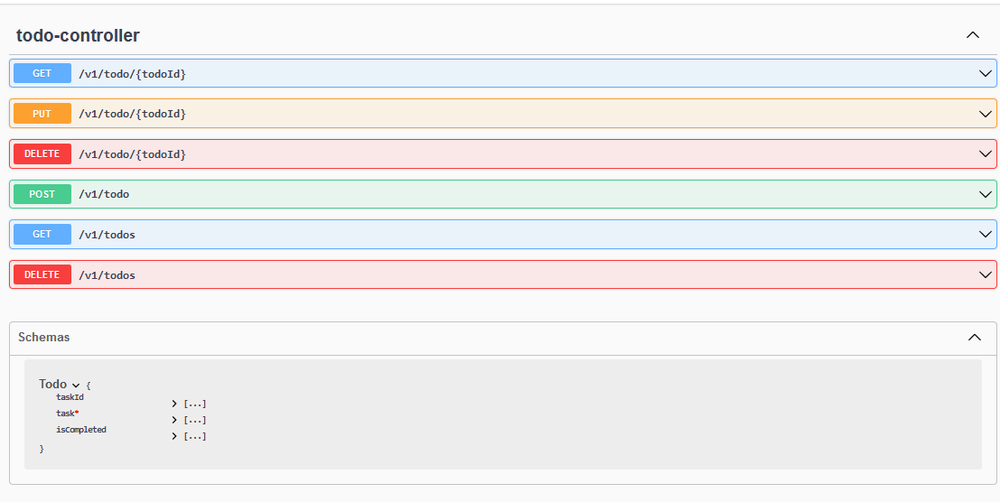

# tr4-todo-backend

# Todo App with Spring Boot REST API
## Description
This project is a REST API designed to create, retrieve, update, and delete to-do list items. It utilizes PostgreSQL as the repository. The primary goal is to showcase skills in creating a REST API with CRUD functionalities while adhering to best practices such as testing, naming conventions, code structure, and readability.

## Approach
The application follows the principles of Spring Boot’s Inversion of Control (IoC) to create loose coupling between components. Mocking and validation are used extensively to ensure the robustness of the code. Custom exceptions and detailed error handling have been implemented to provide clear and informative error messages.

### Architecture
The project is structured to promote separation of concerns and follows the multi-layered architecture pattern. Each layer is organized into its own package:

- **Controller Layer**: Handles HTTP requests and responses. This layer is responsible for receiving user input, processing it (via the service layer), and returning the appropriate HTTP response. 

- **Service Layer**: Contains the business logic. This layer processes data received from the controllers, applies business rules, and calls the repository layer as needed.

- **Repository Layer**: Manages data access. This layer interacts with the database and performs CRUD operations. 

- **Model Layer**: Contains the data models or entities. These classes represent the structure of the data stored in the database. 

This separation of layers promotes modularity, making the application easier to maintain, test, and extend.

## Technologies
- Spring Boot 3.2
- Java 17
- PostgreSQL
- Docker
- Docker Compose
- JUnit
- Postman

## EndPoints
  
  You can test the end points at http://localhost:8080/swagger-ui/index.html

## Installation

### Prerequisites

- Docker installed and running.
- Java Development Kit (JDK) version 17 or higher.
- Maven for dependency management.

### Steps to Run

#### Run with Maven

1. Clone the repository:

   ```bash
   git clone <repository-url>
   cd <project-directory>
   ```
   
2. Set Environment variables:
   ```env
   DB_HOST: ${{ secrets.DB_HOST }}
   DB_USER: ${{ secrets.DB_USER }}
   DB_PASSWORD: ${{ secrets.DB_PASSWORD }}
   DB_PORT: ${{ secrets.DB_PORT }}
   DB_NAME: ${{ secrets.DB_NAME }}

3. ```bash
   $ mvn clean install
   $ mvn spring-boot:run
   ```
   
#### Run with Docker

3. Build using Docker
    Docker image: `docker pull gloal/todo`
    
    `$ docker run -d --hostname=my-container --env DB_NAME=postgres --env DB_PORT=5432 --env DB_PASSWORD=postgres --env DB_USER=postgres --env SPRING_DATASOURCE_URL=jdbc:postgresql://db:5432/postgres --env SPRING_DATASOURCE_USERNAME=postgres --env SPRING_DATASOURCE_PASSWORD=postgres --network=bridge   --name=my-container --restart=no gloal/todo:latest
  `
